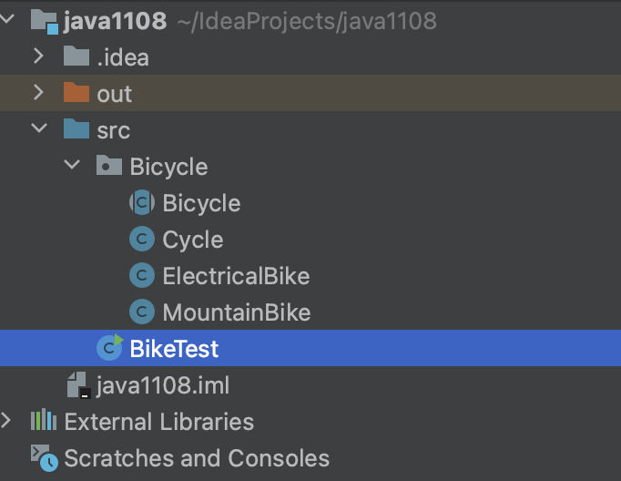

# ✏️ 패키지 (Package)
> 패키지(Package)는 관련 있는 클래스들을 하나로 묶은 것을 말한다.
* 패키지가 필요한 이유
  1. 패키지를 이용하면 서로 관련된 클래스들을 하나의 단위로 모을 수 있다.
  2. 패키지를 이용하여 세밀한 접근 제어를 구현할 수 있다.
  3. 패키지를 사용하는 중요한 이유 중 하나는 **"이름공간"** 때문이다.
  <br>원칙적으로 모든 클래스는 서로 다른 이름을 가져야한다. 즉, 동일한 이름을 가지는 클래스가 여러 개 존재하면 안되는 것이다.<br>패키지만 다르면 각 개발자들은 동일한 이름을 사용할 수 있다.

# ✏️ 패키지 사용
* 패키지 사용 예시



* **Class - Bicycle**
  + package Bicycle을 통해 패키지 선언을 해준다. (아래 클래스도 마찬가지)
```java
package Bicycle;

abstract public class Bicycle{
    protected int gear;
    protected  int speed;

    Bicycle(){
    }

    Bicycle(int gear, int speed){
        this.gear = gear;
        this.speed = speed;
    }

    abstract public void SpeedUp(int a);//(int a){
        //speed += a;
    //}
    abstract public void SpeedDown(int a);//(int a){
        //speed -= a;
    //}
    public void GearUp(int a){
        gear += a;
    }
    public void GearDown(int a){
        gear -= a;
    }
    public void setSpeed(int speed){
        if (speed < 0)
            this.speed = 0;
        else
            this.speed = speed;
    }
    public void print(){
        System.out.println(this.speed);
    }
}
```
* **Class - Cycle**
```java
package Bicycle;

public class Cycle extends Bicycle{
    private boolean isbasket;
    public Cycle(boolean startBasket, int startSpeed, int startGear){
        super(startGear, startSpeed);
        isbasket = startBasket;
    }
    public boolean getBasket(){
        return isbasket;
    }
    public void setBasket(boolean b){
        isbasket = b;
    }
    public void SpeedDown(int per){
        speed = speed - speed*per/100 +10;
    }
    public void SpeedUp(int per){
        speed = speed + speed*per/100 +10;
    }
    public void print(){
        System.out.println(this.speed);
    }
}
```
* **Class - ElectricalBike**
```java
package Bicycle;

public class ElectricalBike extends Bicycle{
    private int battery;
    public ElectricalBike(int startbattery, int startSpeed, int startGear){
        super(startGear, startSpeed);
        battery = startbattery;
    }
    public void setBattery(int bat){
        battery = bat;
    }
    public int  getBattery(){
        return battery;
    }
    public void SpeedDown(int per){
        speed = speed - battery * per/100;
    }
    public void SpeedUp(int per){
        speed = speed - battery * per/100;
    }
    public void print(){
        System.out.println(this.speed);
    }
}
```
* **Class - MountainBike**
```java
package Bicycle;

public class MountainBike extends Bicycle{
    int seatHeight;
    public MountainBike(int startHeight, int startSpeed, int startGear){
        super(startGear, startSpeed);
        seatHeight = startHeight;
    }
    public void setHeight(int height){
        if (height < 0)
            seatHeight = 0;
        else
            seatHeight = height;
    }
    public int getHeight(){
        return seatHeight;
    }
    public void SpeedDown(int per){
        speed -= speed*per/100;
    }
    public void SpeedUp(int per){
        speed += speed*per/100;
    }
    public void print(){
        System.out.println(this.speed);
    }
}
```

* **Main**
  + import를 통해 Bicycle 패키지를 모두 불러온다.
```java
import Bicycle.*;
public class BikeTest{
    public static void main(String args[]){
        Bicycle[] arrayBike;
        arrayBike = new Bicycle[3];

        arrayBike[0] = new MountainBike(10,10,2);
        arrayBike[1] = new Cycle(false,10,2);
        arrayBike[2] = new ElectricalBike(20,10,2);

        for(int i = 0; i <arrayBike.length; i++){
            arrayBike[i].SpeedDown(10);
        }
        for(int i = 0; i <arrayBike.length; i++){
            arrayBike[i].print();
        }
    }
}
```
***
🔺 2022. 11. 08.