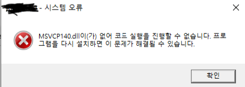

# 🚫 [System error] MSVCP140.dll

>프로그램 설치 중 위와 같은 **MSVCP140.dll** 이 없다는 오류 메시지가 반복해서 떴다. 여러번 재설치를 진행해봐도 해결되지 않았다.

일단 원인을 알기위해 이 파일에 대해서 알아보았다.

이 코드는 Windows 운영 시스템을 위해 Mozilla 에서 개발한 Firefox와 관련된 dll 파일 유형이다.

dll 확장자 유형은 평소에 시스템 파일로 자주 봤던 것으로 기억하지만 무엇인지 자세히 알기 위해 찾아보았다.

dll 유형은 Dynamic Link Library 를 줄인 것으로 동적 링크 라이브러리라고 한다.

이름과 같이 어떤 파일을 실행할때 같이 동작되는 동적인 라이브러리라고 생각하면 될 것 같다.

이 오류메시지의 원인은 MSVCP140.dll 파일이 제 역할을 하지 못하는 상태이거나 존재하지 않을 때 뜨는 메시지이다.

이 파일이 컴퓨터에서 갑자기 에러를 발생시킨 의심할만한 원인은 PC를 제대로 종료하지 않고 스위치를 내리거나 강제종료를 하거나 바이러스에 감염되어서 이 파일이 손상된 것이다.

바이러스는 아닌 것으로 보아 강제종료를 너무 자주해서 그런 것으로 추측된다.

손상된 파일을 재설치하기 위해 마이크로소프트 홈페이지에 Visual Studio용 C++패키지를 통채로 설치하였다.

MSVCP140.dll 을 포함한 패키지 파일을 재설치한 후 필요한 프로그램은 에러없이 잘 설치할 수 있게 되었다.

